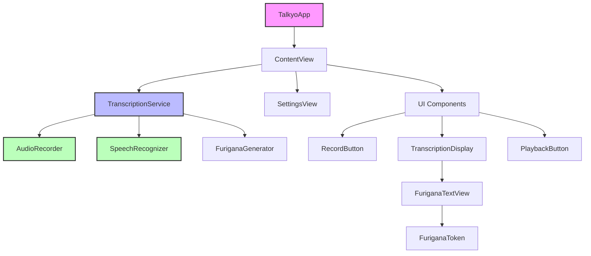

# Talkyo

A modern iOS app for Japanese speech transcription with furigana (reading hints) displayed above kanji characters. Built with SwiftUI and leveraging Apple's Speech Recognition framework for accurate Japanese transcription.

## Features

- **Transcription Modes**: Choose between Standard (post-processing) or Live (real-time)
- **Push-to-Talk Recording**: Hold to record, release to transcribe, swipe to cancel
- **Japanese Speech Recognition**: Powered by Apple's Speech Recognition framework  
- **Furigana Display**: Automatic hiragana readings above kanji characters
- **Custom Japanese Font**: KosugiMaru font optimized for readability
- **Recognition Options**: On-device (private), server (accurate), or hybrid
- **Haptic Feedback**: Tactile feedback for all recording actions
- **Audio Playback**: Review your recordings after transcription

## Requirements

- iOS 18.0+
- Xcode 16.0+
- Physical iOS device (audio features don't work in simulator)

## Setup

1. Clone the repository:
   ```bash
   git clone https://github.com/yourusername/talkyo.git
   cd talkyo
   ```

2. Open the project in Xcode:
   ```bash
   open Talkyo.xcodeproj
   ```

3. Select your development team in the project settings

4. Build and run on a physical device (not simulator)

## Permissions

The app will request the following permissions on first launch:
- **Microphone**: Required for audio recording
- **Speech Recognition**: Required for transcription

## Usage

1. Launch the app
2. Select transcription mode (Standard or Live)
3. Choose recognition mode (On-device, Server, or Hybrid)
4. Press and hold the microphone button to record
5. Release to transcribe or swipe away to cancel
6. View transcribed text with furigana above kanji
7. Tap play to review your recording

### Transcription Modes
- **Standard**: Records complete audio, then transcribes (more accurate, shows processing time)
- **Live**: Real-time transcription as you speak (immediate feedback)

## Project Structure



### Core Files

#### App Entry & Views
- **`TalkyoApp.swift`** - App entry point, sets up the main window
- **`ContentView.swift`** - Main UI with recording button, transcription display, and controls
- **`SettingsView.swift`** - Settings screen for transcription and recognition modes

#### Services (Business Logic)
- **`TranscriptionService.swift`** - Orchestrates the transcription workflow, coordinates between audio recording and speech recognition
- **`AudioRecorder.swift`** - Handles audio recording, playback, and real-time audio buffer streaming
- **`SpeechRecognizer.swift`** - Wraps Apple's Speech framework for Japanese transcription

#### Japanese Text Processing
- **`FuriganaGenerator.swift`** - Generates hiragana readings for kanji using iOS's Japanese tokenizer
- **`FuriganaToken.swift`** - Data model representing a text segment with optional furigana reading
- **`FuriganaTextView.swift`** - Custom SwiftUI view that displays Japanese text with furigana above kanji

### Data Flow

1. **Recording Flow**:
   - User holds `RecordButton` → `TranscriptionService.startRecording()`
   - `AudioRecorder` captures audio → saves as WAV file
   - For live mode: audio buffers stream to `SpeechRecognizer`

2. **Transcription Flow**:
   - `SpeechRecognizer` processes audio → returns Japanese text
   - `FuriganaGenerator` analyzes text → creates `FuriganaToken` array
   - `FuriganaTextView` displays tokens with readings above kanji

3. **Settings Flow**:
   - User changes settings in `SettingsView`
   - Settings update `TranscriptionService` configuration
   - Changes apply to next recording/transcription

## Architecture Details

See [CLAUDE.md](CLAUDE.md) for in-depth architecture documentation and development guidelines.

## Code Style & Formatting

This project uses `swift-format` with 2-space indentation. A pre-commit hook automatically formats all Swift files before committing.

To manually format the code:
```bash
swift format -i -r Talkyo/
```

## Key Technologies

- **SwiftUI** - Modern declarative UI framework
- **Swift 6 Concurrency** - Async/await and actors for thread-safe operations
- **@Observable** - Swift's modern observation framework (no ViewModels)
- **Speech Framework** - Apple's on-device and server-based speech recognition
- **AVFoundation** - Audio recording and playback
- **Translation Framework** - Optional translation to device language

## Development

See [TODO.md](TODO.md) for the development roadmap and future features.

## Contributing

1. Fork the repository
2. Create a feature branch
3. Commit your changes (formatting will be applied automatically)
4. Push to your branch
5. Open a pull request

## License

[Add your license here]